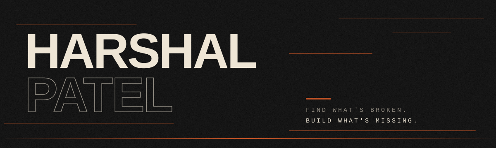

<p align="center">
  
</p>

<p align="center">
  <a href="https://harshal-patel-chi.vercel.app"><b>harshal-patel-chi.vercel.app</b></a>
</p>

My portfolio. Black background, film grain, big type, and a lot of motion I probably shouldn't have spent this many weekends on.

## What's in it

- **A quote before the site.** Every visit opens on a random anime quote that fades in letter by letter. Skip it or wait it out.
- **A cursor that trails.** 20 nodes on a canvas, with speed and friction. Turns itself off for `prefers-reduced-motion`.
- **Speed lines between sections.** Jumping across the page fires a warp instead of a plain scroll.
- **Tile-flip page transitions.** Leaving for a project flips the screen into the next page, tile by tile, then smokes away.
- **12 languages,** CJK fonts included. There's also a hidden 13th. I'm not telling you how to find it.

## Run it

```bash
git clone https://github.com/HarshalPatel1972/harshal-patel.git
cd harshal-patel
npm install
npm run dev      # http://localhost:3000
npm test         # vitest
```

Needs Node 20.9 or newer.

## Built with

Next.js 16 · React 19 · TypeScript · Tailwind 4 · anime.js 4 · Framer Motion · Supabase (feedback) · Redis (rate limiting)

## Layout

```
src/components/new/        current design
src/components/old/        the first design, still bundled
src/components/ui/         cursor, warp, page transitions
src/components/Preloader   the quote intro
src/app/api/               feedback, visitor count
```

## License

Look, learn, borrow ideas. Don't ship it as your own or use it commercially, and credit me if you build on it. Full terms in [LICENSE](LICENSE) (HPCL v1.0).
